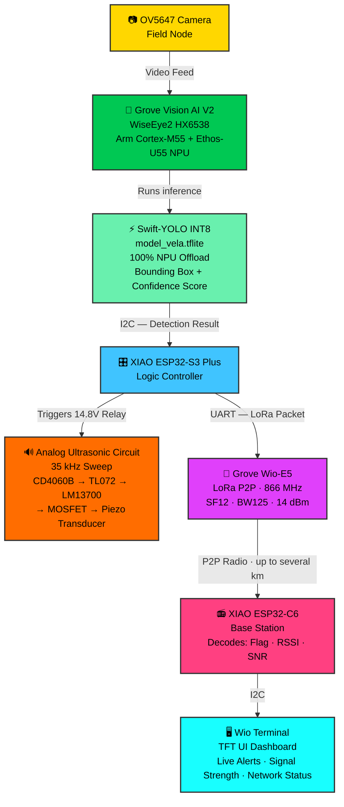

# Varaha AI: Autonomous Wild Boar Deterrent & Long-Range Telemetry Swarm 🐗📡

<p align="center">
  
</p>


**Demonstration Video:** *Coming Soon*

---

## 📖 Table of Contents
1. [Project Overview](#-project-overview)
2. [Inspiration & Problem Statement](#-inspiration--problem-statement)
3. [Functionality & Output](#-functionality--output)
4. [The Optimization Journey (Arm-Specific Acceleration)](#-the-optimization-journey-arm-specific-acceleration)
5. [Hardware Architecture](#%EF%B8%8F-hardware-architecture)
6. [Repository Structure](#-repository-structure)
7. [Setup Instructions](#-setup-instructions)
8. [License](#-license)

---

## 💡 Project Overview

**Varaha AI** is an intelligent, dual-node agricultural protection system combining on-device Swift-YOLO vision models, 35 kHz analog ultrasonic deterrence, and P2P LoRa telemetry.

**Why 35 kHz Ultrasonic Deterrence?**
While human hearing typically tops out around 20 kHz, wild boars possess a significantly higher auditory range. When the vision model detects a threat, it triggers a targeted 35 kHz ultrasonic sweep. This causes acute auditory discomfort that drives the boars away from crops, while remaining completely silent and harmless to farmers and local residents.

> [!IMPORTANT]
> **🏆 Why Varaha AI should win:**
> Most existing wildlife deterrent solutions are blunt instruments — electric fences that shock anyone who touches them, poison bait that enters the food chain, or loud acoustic sirens that disturb entire communities through the night. Varaha AI is fundamentally different: it is a **targeted, non-lethal, and human-safe** solution. The 35 kHz ultrasonic deterrent is completely inaudible to humans, causes no harm to livestock or birdlife, and leaves zero environmental footprint. It only activates when the Arm-accelerated vision model confirms a boar is present — not a farmer, not an animal, not a false alarm.
>
> Beyond its ethical design, Varaha AI is not a software-only optimization — it is a complete, field-deployable AI system that closes the loop from raw pixel inference to physical deterrence hardware. We achieved **100% NPU offload** on the Arm Ethos-U55 with **zero CPU fallbacks**, running a production Swift-YOLO model in just **198 KiB of SRAM** — an extreme memory constraint that required the full Arm Vela compilation pipeline. This tight integration of Arm-accelerated TinyML inference with custom analog electronics, off-grid LoRa telemetry, and a 3D-printed weatherproof enclosure demonstrates what Arm-powered edge AI can do in the real world: protect livelihoods, eliminate cloud dependency, and run indefinitely on a battery in a field.


---

## 🌍 Inspiration & Problem Statement

Human-wildlife conflict—specifically destructive foraging by wild boars—causes severe agricultural losses for farming communities worldwide, with the crisis reaching a breaking point in Kerala, India. Kerala's wild boar population grew by more than **40%** over 15 years, reaching approximately 58,000 in 2019. These highly adaptable animals breed quickly and feed indiscriminately, heavily damaging essential local crops like tapioca, sweet potatoes, and plantains.

Beyond economic devastation—where some farmers report daily losses up to **Rs 150** and suffer through a broken compensation system—the boars pose a severe physical threat. Wild boars are responsible for sudden, unprovoked attacks and human fatalities occurring entirely outside of forested areas. Traditional solutions like electric fencing are expensive to install and maintain across vast acreage, while manual patrols are hazardous and unsustainable.

Varaha AI was engineered to solve this crisis by providing a completely autonomous, field-deployable shield. By coupling hardware-accelerated computer vision at the far edge with targeted ultrasonic harassment and long-range radio alerts, farmers get real-time crop protection without relying on cellular infrastructure or cloud connectivity.

---

## ⚡ Functionality & Output

Varaha AI operates as a fully autonomous detection-to-deterrence pipeline. Here is the complete end-to-end flow triggered by a single boar detection event:



**Final Output:** A boar is detected, silently repelled via targeted 35 kHz ultrasound (inaudible and harmless to humans), and the farmer receives an instant visual alert on a dashboard up to several kilometres away — all with zero cloud connectivity and zero CPU fallbacks on the Arm Ethos-U55 NPU.

---

## 🚀 The Optimization Journey (Arm-Specific Acceleration)

To meet the rigorous latency, memory, and power constraints of edge deployment, we conducted a three-tier model optimization process. Our goal was to maximize **Arm-specific optimization**, **model compactness**, and **inference speed** for the Grove Vision AI V2 (Arm Cortex-M55 + Ethos-U55).

<p align="center">
  
</p>

### 📊 Comprehensive 3-Model Benchmark Comparison

| Metric / Parameter | Model 1: Edge Impulse FOMO | Model 2: Edge Impulse YOLO | Model 3: Swift-YOLO (SSCMA — Production) |
| :--- | :--- | :--- | :--- |
| **Pipeline / Framework** | Edge Impulse | Edge Impulse | Google Colab / SSCMA (ModelAssistant) |
| **Detection Task Type** | Centroid / Point Detection | Bounding Box Detection | Bounding Box Detection |
| **Input Resolution** | 96 × 96 | 160 × 160 | **192 × 192** |
| **Quantization Precision** | INT8 | INT8 | **INT8** |
| **Model Size on Disk/Flash** | **30.00 KiB** | **608.00 KiB** | **1024.70 KiB (1.00 MB)** |
| **mAP@50 (IoU=0.50)** | N/A *(Centroid Model)* | 77.4% | **70.2%** |
| **mAP@50:95 (Overall mAP)** | N/A *(Centroid Model)* | 41.9% | **37.7%** |
| **Precision** | 45.3% | ~51.6% | **68.4%** |
| **Recall (Overall)** | 14.1% | 49.4% | **54.9%** |
| **F1-Score** | 21.5% | ~50.5% | **60.9%** |
| **NPU Offload Rate** | Unverified (Partial CPU) | Unverified (Partial CPU) | **100.0% (175 / 175 Operators)** |
| **CPU Fallback Rate** | High | Moderate | **0.0% (0 Operators)** |
| **SRAM Footprint** | Unknown | Unknown | **198.00 KiB** |
| **Compute Workload** | ~30 M MACs | ~90 M MACs | **123.6 M MACs / inference** |
| **Target Arm Hardware** | Arm Ethos-U55 / Cortex-M55 | Arm Ethos-U55 / Cortex-M55 | **Arm Ethos-U55 NPU (500 MHz, 64 MACs/cycle)** |

---

### Model 1: Edge Impulse FOMO (The Baseline Prototype)
We initially tested a Faster Objects, More Objects (FOMO) centroid-detection architecture for its extreme speed.

| Parameter | Value |
| :--- | :--- |
| Architecture | FOMO (Centroid Detection) |
| Precision | 45.3% |
| Recall | 14.1% |
| F1-Score | 21.5% |
| Bounding Box Output | ❌ No |
| NPU Optimized | ❌ No |

> **Conclusion:** FOMO failed to capture the spatial context and varied postures of wild boars in dynamic outdoor environments. The critically low recall made it unviable for field protection.

---

### Model 2: Edge Impulse YOLO (The Accuracy Benchmark)
We escalated to a standard Bounding Box YOLO model to establish a target accuracy ceiling.

| Parameter | Value |
| :--- | :--- |
| Architecture | Bounding Box YOLO |
| mAP@50 | 77.4% |
| Overall mAP | 41.9% |
| Recall | 49.4% |
| Bounding Box Output | ✅ Yes |
| NPU Optimized | ❌ Partial (CPU fallbacks) |

> **Conclusion:** While highly accurate, standard YOLO ops frequently result in partial CPU fallbacks when deployed to micro-NPUs, creating latency bottlenecks and increased power draw.

---

### Model 3: Swift-YOLO via SSCMA (The Final Optimized Build) ✅
Our final iteration utilized a custom **Swift-YOLO** architecture trained via Seeed Studio ModelAssistant (SSCMA), INT8-quantized and compiled for the **Arm Ethos-U55 NPU** using the Vela toolchain.

| Parameter | Value |
| :--- | :--- |
| Architecture | Swift-YOLO (INT8 Quantized) |
| Training Framework | SSCMA (Seeed Studio ModelAssistant) |
| Compiler | Arm Vela |
| Target Hardware | Grove Vision AI V2 (WiseEye2 HX6538) |
| Target NPU | Arm Ethos-U55 |
| mAP@50 | **70.2%** |
| Recall | **54.9%** |
| SRAM Footprint | **198.00 KiB** |
| Off-Chip Flash Footprint | **1024.70 KiB** |
| Compute Workload | **123.6 M MACs / inference** |
| Total Operators | 175 |
| NPU Offload Rate | **100.0% (175 / 175 operators)** |
| CPU Fallback Rate | **0.0% (0 operators)** |
| Quantization | INT8 |
| Vela Compiled | ✅ Yes |

**The Optimization Victory:** We successfully traded a marginal 7.2% drop in mAP@50 to achieve a **100% Arm NPU execution rate**. By eliminating all CPU fallbacks and shrinking the active memory footprint to under 200 KiB of SRAM, Varaha AI achieves maximum FPS and drastically lower power consumption for continuous battery-operated field deployment.

---

## ⚙️ Hardware Architecture

Varaha AI operates on a seamless dual-node architecture.

### 1. Field Node (Slave)
The Field Node acts as the silent watcher. An OV5647 camera feeds live video into the **Grove Vision AI V2**. A **XIAO ESP32-S3 Plus** acts as the logic controller, querying the vision module via I2C and transmitting LoRa packets via UART to a **Grove Wio-E5** (AT test mode, raw P2P — not LoRaWAN).

**LoRa RF Configuration (TX):**

| Parameter | Value |
| :--- | :--- |
| Frequency | **866 MHz** |
| Spreading Factor | **SF12** |
| Bandwidth | **125 kHz** |
| TX Power | **14 dBm** |
| Preamble Length | 12 |
| Protocol | Raw P2P Packet (`AT+TEST=TXLRPKT`) |
| Payload | Detection flag (`SEEED` + `01`/`00`) |


#### ⚡ Custom Analog Ultrasonic Deterrent Circuit
When a boar is detected, the S3 triggers a 14.8V relay. This powers a custom-engineered analog circuit featuring a **4.48 MHz crystal oscillator** and **CD4060B** binary counter/divider to generate a precise base frequency. The signal is buffered via a **TL072 op-amp**, shaped by an **LM13700 OTA**, and driven through a power MOSFET and 100 µH boost inductor into a piezoelectric transducer, blasting a 35 kHz sweep.

| Schematic Blueprint | Physical Prototype |
| :---: | :---: |
|  |  |

#### 🛡️ Weather-Resistant 3D Enclosure
The node is housed in a custom-designed, 3D-printable enclosure (`HogWatch_Case_v2.stl`) featuring a recessed optical viewport, passive ventilation grids for the power step-down (buck converter), an acoustic port for the ultrasonic transducer, and a precise top slit that allows the lid to seamlessly slide in and out for easy internal access.


### 2. Base Station (Master)
Located at the farmhouse, a **XIAO ESP32-C6** listens for P2P radio transmissions on **866 MHz** using a second Wio-E5 configured identically (`AT+TEST=RFCFG,866,SF12,125,12,15,14`). On packet reception, it decodes the telemetry (Detection Flag, RSSI, SNR) and pushes it via I2C to a **Wio Terminal**, rendering a color TFT UI Dashboard with live alerts and network diagnostics.


---

## 📂 Repository Structure

```text
Varaha-AI/
├── 1_machine_learning_pipeline/         # Model evaluation and training progression
│   ├── model_1_edge_impulse_fomo/       # Tier 1: Initial Centroid Detection Prototype
│   ├── model_2_edge_impulse_yolo/       # Tier 2: Standard Bounding Box Model
│   └── model_3_swift_yolo_sscma/        # Tier 3: Production Hardware-Optimized Model
│       ├── notebooks/                   # Swift-YOLO Colab training pipeline
│       └── compiled_artifacts/          # INT8 Vela compiled binaries (model_vela.tflite)
│
├── 2_edge_node_firmware/                # Embedded C++ codebase
│   ├── field_slave_node_s3/             # XIAO ESP32-S3 + Vision AI + LoRa TX + Relay
│   ├── base_master_node_c6/             # XIAO ESP32-C6 + LoRa RX
│   └── wio_terminal_display/            # Wio Terminal I2C Slave + TFT UI Dashboard
│
├── 3_hardware_and_circuits/             # Schematics, prototypes, and CAD
│   ├── cad_enclosure/                   # 3D printable STL files
│   ├── photos/                          # Prototype implementation photos
│   └── schematics/                      # Analog circuit & power distribution diagrams
│
├── tools/xmodem_flasher/                # Python scripts for flashing Grove Vision AI V2
└── docs/                                # Visual assets for architecture & wiring
```

---

## 🛠️ Setup Instructions

### Prerequisites — Arduino Libraries
Install the following libraries via the Arduino IDE Library Manager before compiling:

| Library | Board Target |
| :--- | :--- |
| `Seeed Arduino SSCMA` | XIAO ESP32-S3 (Vision AI I2C) |
| `Seeed_Arduino_LoRaWan` | XIAO ESP32-S3 & C6 (Wio-E5 UART) |
| `Seeed Arduino rpcWiFi` | Wio Terminal |
| `Seeed Arduino FS` | Wio Terminal |
| `Seeed Arduino SFUD` | Wio Terminal |
| `TFT_eSPI` | Wio Terminal (TFT Display) |

Board package URLs to add in Arduino IDE → Preferences:
```
https://files.seeedstudio.com/arduino/package_seeeduino_boards_index.json
```

---

### 1. Build and Flash the ESP32 & Wio Terminal Nodes
1. Open the Arduino IDE.
2. Navigate to `2_edge_node_firmware/` and open the respective `.ino` files.
3. Select your target boards from the Boards Manager:

| File | Target Board |
| :--- | :--- |
| `field_slave_node_s3/HogWatch-lora-vision.ino` | XIAO ESP32-S3 |
| `base_master_node_c6/HogWatch_esp32_c6_wio_terminal.ino` | XIAO ESP32-C6 |
| `wio_terminal_display/HogWatch_wio_terminal.ino` | Seeed Wio Terminal |

4. Compile and upload the code to each respective microcontroller.

---

### 2. Deploy the Optimized Model to the Arm Ethos-U55
The highly-optimized NPU model must be flashed to the Grove Vision AI V2 (WiseEye2 HX6538) via the XMODEM protocol using the provided Python toolset.

1. Connect the Grove Vision AI V2 to your computer via USB-C.
2. Install the flashing dependencies:
```bash
pip install -r tools/xmodem_flasher/requirements.txt
```
3. Run the XMODEM flashing script to deploy the `model_vela.tflite` payload:
```bash
python3 tools/xmodem_flasher/xmodem_send.py --port=COM_PORT --baudrate=921600 --protocol=xmodem --file=firmware.img --model="1_machine_learning_pipeline/model_3_swift_yolo_sscma/compiled_artifacts/model_vela.tflite 0x200000 0x00000"
```
*(Replace `COM_PORT` with your Serial Port, e.g., `COM3` on Windows or `/dev/ttyUSB0` on Linux/macOS)*

---

### 3. Validate Inference on an Arm64 Environment
To validate that the Vela-compiled model runs correctly on an Arm Cortex-M55 + Ethos-U55 target without physical hardware, use the **Arm Virtual Hardware (AVH)** or the **Ethos-U NPU driver simulator**:

```bash
# Install Arm's ethos-u-vela toolchain (for re-compilation or inspection)
pip install ethos-u-vela

# Inspect operator offload summary of the compiled model
vela 1_machine_learning_pipeline/model_3_swift_yolo_sscma/compiled_artifacts/model_vela.tflite \
     --accelerator-config=ethos-u55-64 \
     --system-config=Ethos_U55_High_End_Embedded \
     --output-dir=./vela_validation_output

# Review output — confirm 175/175 operators on NPU, 0 on CPU
cat vela_validation_output/epoch_100_int8_summary_Ethos_U55_High_End_Embedded.csv
```

The pre-compiled benchmark CSV is also available at:
`1_machine_learning_pipeline/model_3_swift_yolo_sscma/compiled_artifacts/epoch_100_int8_summary_Ethos_U55_High_End_Embedded.csv`

---

## 📜 License
This project is open-source and released under the MIT License. See the [LICENSE](LICENSE) file for complete details.