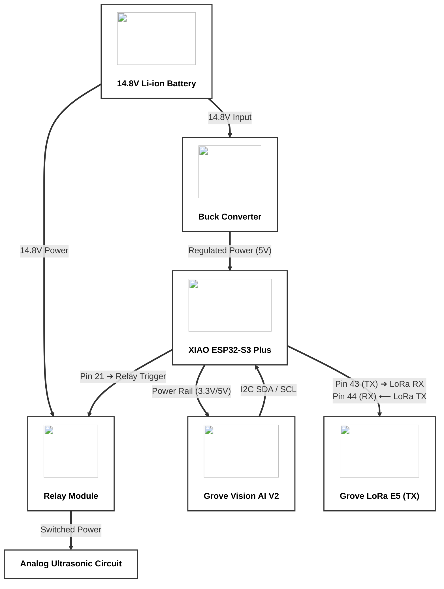
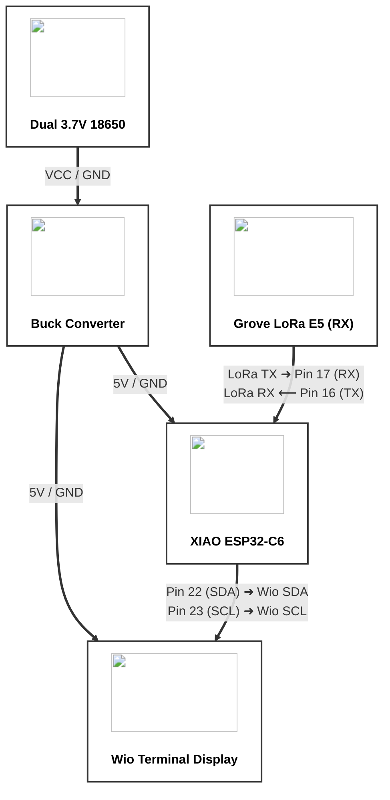

# Varaha AI — Wiring Diagrams

> **Note:** GitHub renders Mermaid diagrams natively. Open this file on GitHub to see the interactive, image-embedded diagrams below.

---

## 1. Field Node Pictorial Wiring Diagram

---

## 2. Base Station Pictorial Wiring Diagram

