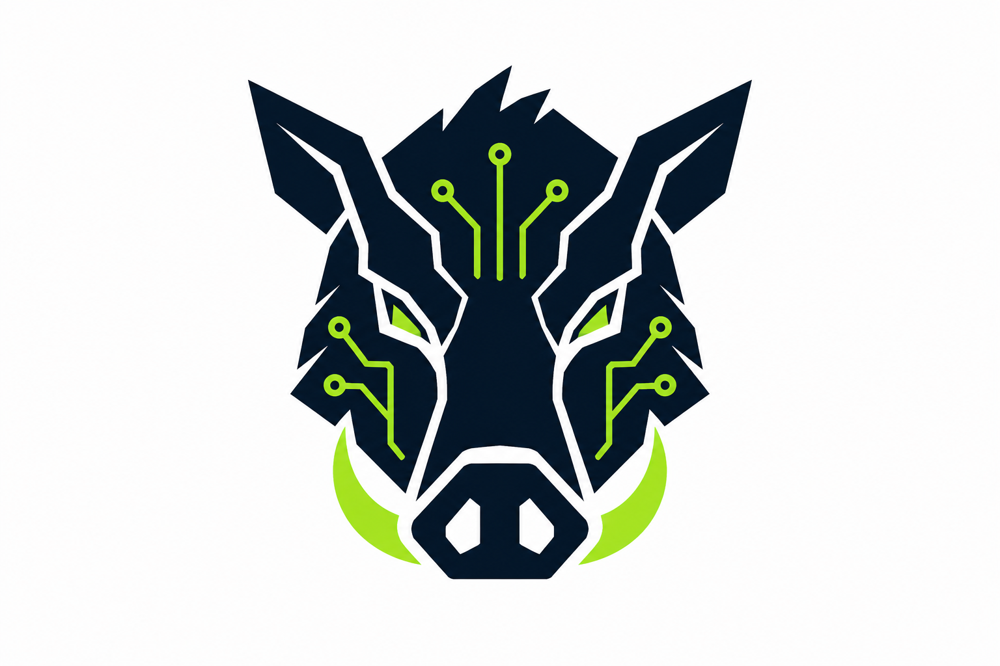
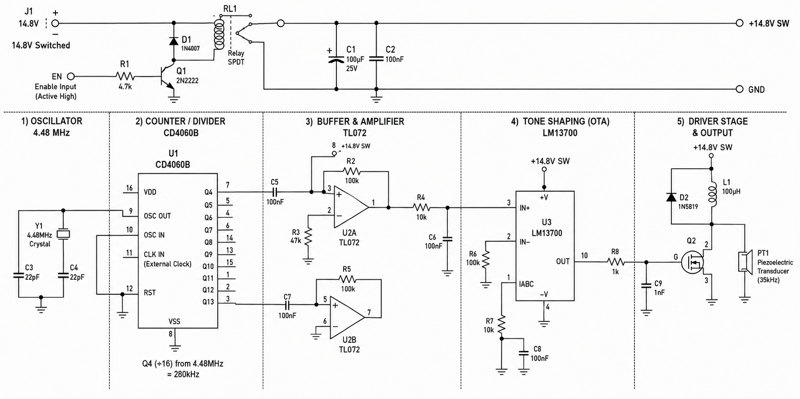
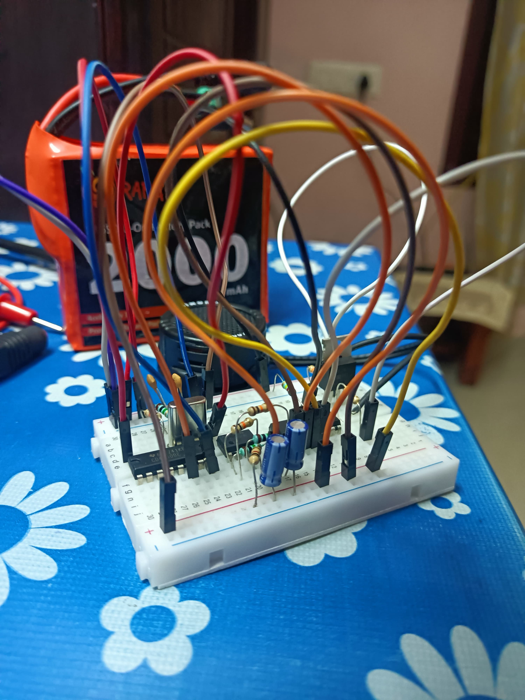
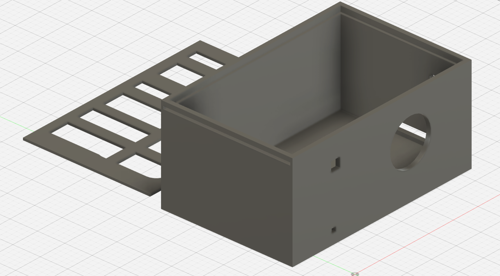

# Varaha AI: Autonomous Wild Boar Deterrent & Long-Range Telemetry Swarm 🐗📡

<p align="center">
  
</p>


**Demonstration Video:** [Insert YouTube/Vimeo Link Here]

---

## 📖 Table of Contents
1. [Project Overview](#-project-overview)
2. [Inspiration & Problem Statement](#-inspiration--problem-statement)
3. [The Optimization Journey (Arm-Specific Acceleration)](#-the-optimization-journey-arm-specific-acceleration)
4. [Functionality & Hardware Architecture](#%EF%B8%8F-functionality--hardware-architecture)
5. [Repository Structure](#-repository-structure)
6. [Setup Instructions](#-setup-instructions)
7. [License](#-license)

---

## 💡 Project Overview
**Varaha AI** is an intelligent, dual-node agricultural protection system combining on-device Swift-YOLO vision models, 35 kHz analog ultrasonic deterrence, and P2P LoRa telemetry. 

**What makes it interesting and why it should win:** 
Varaha AI bridges the gap between cutting-edge TinyML and raw analog electronics. Instead of simply running a model to log data, it optimizes a custom neural network to run with **100% NPU offload on the Arm Ethos-U55**, using the inference output to trigger a highly specific acoustic hardware deterrent over an entirely off-grid LoRa mesh network. By driving the model footprint down to just **198 KiB of SRAM** and completely eliminating CPU fallbacks, Varaha AI perfectly demonstrates how extreme optimization enables complex AI workflows on low-power edge devices.

---

## 🌍 Inspiration & Problem Statement
Human-wildlife conflict—specifically destructive foraging by wild boars—causes severe agricultural losses for farming communities worldwide, with the crisis reaching a breaking point in Kerala, India. Kerala's wild boar population grew by more than **40%** over 15 years, reaching approximately 58,000 in 2019. These highly adaptable animals breed quickly and feed indiscriminately, heavily damaging essential local crops like tapioca, sweet potatoes, and plantains. 

Beyond economic devastation—where some farmers report daily losses up to **Rs 150** and suffer through a broken compensation system—the boars pose a severe physical threat. Wild boars are responsible for sudden, unprovoked attacks and human fatalities occurring entirely outside of forested areas. Traditional solutions like electric fencing are expensive to install and maintain across vast acreage, while manual patrols are hazardous and unsustainable. 

Varaha AI was engineered to solve this crisis by providing a completely autonomous, field-deployable shield. By coupling hardware-accelerated computer vision at the far edge with targeted ultrasonic harassment and long-range radio alerts, farmers get real-time crop protection without relying on cellular infrastructure or cloud connectivity.

---

## 🚀 The Optimization Journey (Arm-Specific Acceleration)
To meet the rigorous latency, memory, and power constraints of edge deployment, we conducted a three-tier model optimization process. Our goal was to maximize **Arm-specific optimization**, **Model size**, and **Model speed** for the Grove Vision AI V2 (Arm Cortex-M55 + Ethos-U55).

### Model 1: Edge Impulse FOMO (The Baseline Prototype)
We initially tested a Faster Objects, More Objects (FOMO) centroid-detection architecture for its extreme speed.
*   **Precision:** 45.3%
*   **Recall:** 14.1%
*   **F1-Score:** 21.5%
*   **Conclusion:** FOMO failed to capture the spatial context and varied postures of wild boars in dynamic outdoor environments. The low recall made it unviable for agricultural protection.

### Model 2: Edge Impulse YOLO (The Accuracy Benchmark)
We escalated to a standard Bounding Box YOLO model to establish a target accuracy threshold.
*   **mAP@50:** 77.4%
*   **Overall mAP:** 41.9%
*   **Recall:** 49.4%
*   **Conclusion:** While highly accurate, standard YOLO ops frequently result in partial CPU fallbacks when deployed to micro-NPUs, creating latency bottlenecks and increasing power consumption.

### Model 3: Swift-YOLO via SSCMA (The Final Optimized Build)
Our final iteration utilized a custom **Swift-YOLO** architecture trained via Seeed Studio ModelAssistant (SSCMA). We INT8-quantized the model and compiled it specifically for the **Arm Ethos-U55 NPU** using the Vela toolchain.

*   **mAP@50:** 70.2%
*   **Recall:** 54.9%
*   **SRAM Footprint:** 198.00 KiB
*   **Off-Chip Flash Footprint:** 1024.70 KiB
*   **Compute Workload:** 123.6 M MACs / inference
*   **NPU Offload Rate:** **100.0% (175 / 175 Operators)**
*   **CPU Fallback Rate:** **0.0% (0 Operators)**

**The Optimization Victory:** We successfully traded a marginal 7.2% drop in mAP@50 to achieve a **100% Arm NPU execution rate**. By eliminating all CPU fallbacks and shrinking the active memory footprint to under 200 KiB of SRAM, Varaha AI achieves maximum frames-per-second (FPS) and drastically lower power consumption for continuous battery-operated field deployment.

---

## ⚙️ Functionality & Hardware Architecture

Varaha AI operates on a seamless dual-node architecture.

### 1. Field Node (Slave)
The Field Node acts as the silent watcher. An OV5647 camera feeds live video into the **Grove Vision AI V2**. A **XIAO ESP32-S3 Plus** acts as the logic controller, querying the vision module via I2C and handling LoRa UART transmission via a **Grove Wio-E5**. 

#### ⚡ Custom Analog Ultrasonic Deterrent Circuit
When a boar is detected, the S3 triggers a 14.8V relay. This powers a custom-engineered analog circuit featuring a **4.48 MHz crystal oscillator** and **CD4060B** binary counter/divider to generate a precise base frequency. The signal is buffered via a **TL072 op-amp**, shaped by an **LM13700 OTA**, and driven through a power MOSFET and 100 µH boost inductor into a piezoelectric transducer, blasting a 35 kHz sweep.

| Schematic Blueprint | Physical Prototype |
| :---: | :---: |
|  |  |

#### 🛡️ Weather-Resistant 3D Enclosure
The node is housed in a custom-designed, 3D-printable enclosure (`HogWatch_Case_v2.stl`) featuring a recessed optical viewport, passive ventilation grids for the power step-down (buck converter), and an acoustic port for the ultrasonic transducer.



### 2. Base Station (Master)
Located at the farmhouse, a **XIAO ESP32-C6** catches long-range P2P radio transmissions at 868/915 MHz using a second Wio-E5. It decodes the telemetry (Detection Flag, RSSI, SNR) and pushes it via I2C to a **Wio Terminal**, rendering a color TFT UI Dashboard that provides live alerts and network diagnostics.


---

## 📂 Repository Structure

```text
Varaha-AI/
├── 1_machine_learning_pipeline/         # Model evaluation and training progression
│   ├── model_1_edge_impulse_fomo/       # Tier 1: Initial Centroid Detection Prototype
│   ├── model_2_edge_impulse_yolo/       # Tier 2: Standard Bounding Box Model
│   └── model_3_swift_yolo_sscma/        # Tier 3: Production Hardware-Optimized Model
│       ├── notebooks/                   # Swift-YOLO Colab training pipeline
│       └── compiled_artifacts/          # INT8 Vela compiled binaries (model_vela.tflite)
│
├── 2_edge_node_firmware/                # Embedded C++ codebase
│   ├── field_slave_node_s3/             # XIAO ESP32-S3 + Vision AI + LoRa TX + Relay
│   ├── base_master_node_c6/             # XIAO ESP32-C6 + LoRa RX
│   └── wio_terminal_display/            # Wio Terminal I2C Slave + TFT UI Dashboard
│
├── 3_hardware_and_circuits/             # Schematics, prototypes, and CAD
│   ├── cad_enclosure/                   # 3D printable STL files
│   ├── photos/                          # Prototype implementation photos
│   └── schematics/                      # Analog circuit & power distribution diagrams
│
├── tools/xmodem_flasher/                # Python scripts for flashing Grove Vision AI V2
└── docs/                                # Visual assets for architecture & wiring
```

---

## 🛠️ Setup Instructions

### 1. Build and Flash the ESP32 & Wio Terminal Nodes
1. Open the Arduino IDE.
2. Navigate to `2_edge_node_firmware/` and open the respective `.ino` files.
3. Select your target boards (XIAO ESP32-S3, XIAO ESP32-C6, or Wio Terminal) from the Boards Manager.
4. Compile and upload the code to each respective micro-controller.

### 2. Deploy the Optimized Model to the Arm Ethos-U55
The highly-optimized NPU model must be flashed to the Grove Vision AI V2 (WiseEye2 HX6538) via the XMODEM protocol using the provided Python toolset.

1. Connect the Grove Vision AI V2 to your computer via USB-C.
2. Install the flashing dependencies in your terminal:
```bash
pip install -r tools/xmodem_flasher/requirements.txt
```
3. Run the XMODEM flashing script to deploy the firmware and the `model_vela.tflite` payload:
```bash
python3 tools/xmodem_flasher/xmodem_send.py --port=COM_PORT --baudrate=921600 --protocol=xmodem --file=firmware.img --model="1_machine_learning_pipeline/model_3_swift_yolo_sscma/compiled_artifacts/model_vela.tflite 0x200000 0x00000"
```
*(Note: Replace `COM_PORT` with your respective Serial Port, e.g., `COM3` on Windows or `/dev/ttyUSB0` on Linux/macOS).*

---

## 📜 License
This project is open-source and released under the MIT License. See the [LICENSE](LICENSE) file for complete details.