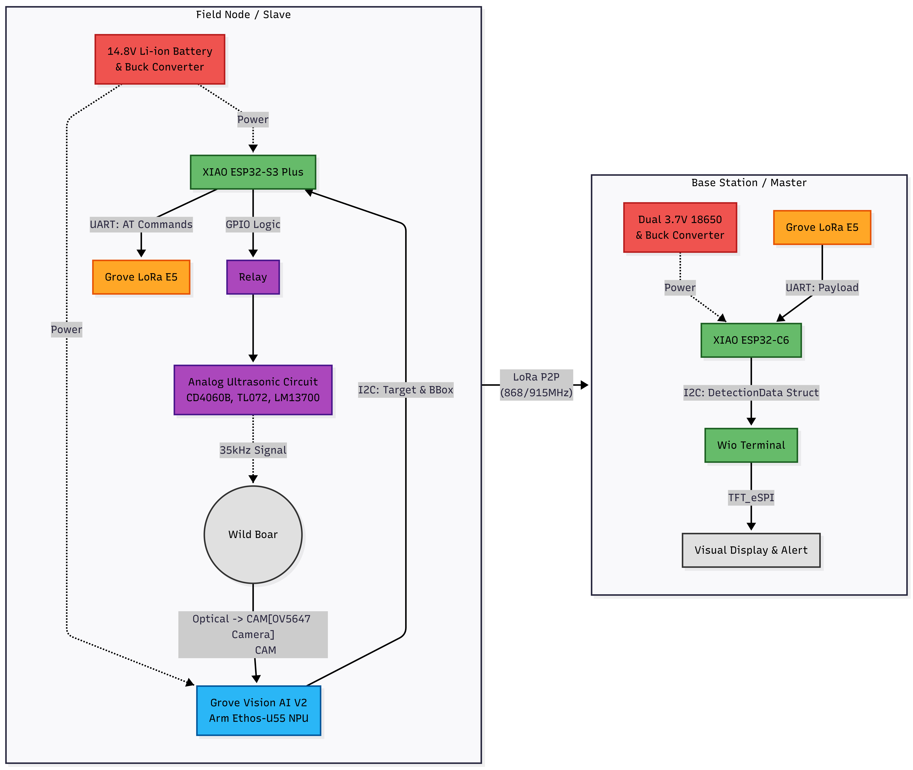
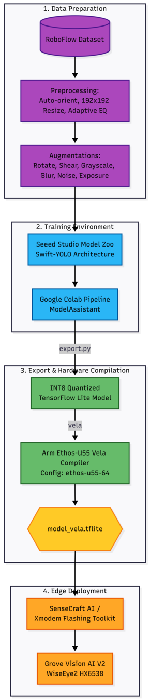

# Varaha AI: Autonomous Edge-AI Wildlife Deterrence & Long-Range Telemetry Swarm 🐗📡

<p align="center">
  
</p>


**An intelligent, dual-node agricultural protection system combining on-device Swift-YOLO vision models, 35 kHz analog ultrasonic deterrence, and P2P LoRa telemetry.**

---

## 📖 Table of Contents
1. [Inspiration & Problem Statement](#-inspiration--problem-statement)
2. [System Architecture](#-system-architecture)
3. [Hardware Engineering](#%EF%B8%8F-hardware-engineering)
4. [Machine Learning & NPU Optimization](#-machine-learning--npu-optimization)
5. [Repository Structure](#-repository-structure)
6. [Getting Started & Flashing Instructions](#-getting-started--flashing-instructions)
7. [License](#-license)

---

## 💡 Inspiration & Problem Statement
Human-wildlife conflict—specifically destructive foraging by wild boars—causes severe agricultural losses for farming communities worldwide. Traditional solutions like electric fencing are expensive to install and maintain across vast acreage, while physical patrols are labor-intensive, hazardous, and unsustainable 24/7.

**Varaha AI** was engineered to solve this crisis by providing a completely autonomous, field-deployable shield. By coupling hardware-accelerated computer vision at the far edge with targeted ultrasonic harassment and long-range radio alerts, farmers get real-time crop protection and continuous field monitoring without relying on cellular infrastructure or cloud connectivity.

---

## 🏗️ System Architecture
Varaha AI operates on a seamless dual-node architecture spanning the active field zone and the farmer's remote monitoring station.



---

## ⚙️ Hardware Engineering

### 1. Field Node (Slave)
The Field Node acts as the silent watcher. An OV5647 camera feeds live video into a **Grove Vision AI V2** module powered by the WiseEye2 HX6538 processor (Dual-core Arm Cortex-M55 + Arm Ethos-U55 NPU). A **XIAO ESP32-S3 Plus** acts as the logic controller, querying the vision module via I2C and handling LoRa UART transmission via a **Grove Wio-E5**.


#### ⚡ Custom Analog Ultrasonic Deterrent Circuit
When a boar is detected, the S3 triggers a 14.8V relay. This powers a custom-engineered analog circuit featuring a **4.48 MHz crystal oscillator** and **CD4060B** binary counter/divider to generate a precise base frequency. The signal is buffered via a **TL072 op-amp**, shaped by an **LM13700 OTA**, and driven through a power MOSFET and 100 µH boost inductor into a piezoelectric transducer, blasting a 35 kHz sweep.

| Schematic Blueprint | Physical Prototype |
| :---: | :---: |
|  |  |

#### 🛡️ Weather-Resistant 3D Enclosure
The node is housed in a custom-designed, 3D-printable enclosure featuring a recessed optical viewport, passive ventilation grids for the power step-down (buck converter), and an acoustic port for the ultrasonic transducer.


### 2. Base Station (Master)
Located at the farmhouse, a **XIAO ESP32-C6** catches long-range P2P radio transmissions at 868/915 MHz using a second Wio-E5. It decodes the telemetry (Detection Flag, RSSI, SNR) and pushes it via I2C to a **Wio Terminal**, rendering a color TFT UI Dashboard that provides live alerts and network diagnostics.


---

## 🧠 Machine Learning & NPU Optimization
To achieve real-time detection on low-power edge hardware, we evaluated multiple architectures before deploying a custom **Swift-YOLO** model trained via SSCMA in Google Colab. The model was INT8-quantized and fully compiled for the **Arm Ethos-U55 NPU** using the Vela toolchain.



### Final Ethos-U55 NPU Benchmarks
| Metric | Value |
| :--- | :--- |
| **Detection Precision (mAP@50)** | **70.2%** |
| **NPU Offload Rate** | **100.0%** (175 / 175 Operators) |
| **CPU Fallback Rate** | **0.0%** (0 Operators) |
| **SRAM Footprint** | **198.00 KiB** |
| **Off-Chip Flash Footprint** | 1024.70 KiB |
| **NPU Compute Workload** | 123.6 M MACs / inference |

---

## 📂 Repository Structure
```text
Varaha-AI/
├── 1_machine_learning_pipeline/         # Model evaluation and training progression
│   ├── model_1_edge_impulse_fomo/       # Tier 1: Initial Centroid Detection Prototype
│   ├── model_2_edge_impulse_yolo/       # Tier 2: Standard Bounding Box Model
│   └── model_3_swift_yolo_sscma/        # Tier 3: Production Hardware-Optimized Model
│       ├── notebooks/                   # Swift-YOLO Colab training pipeline
│       └── compiled_artifacts/          # INT8 Vela compiled binaries (model_vela.tflite)
│
├── 2_edge_node_firmware/                # Embedded C++ codebase
│   ├── field_slave_node_s3/             # XIAO ESP32-S3 + Vision AI + LoRa TX + Relay
│   ├── base_master_node_c6/             # XIAO ESP32-C6 + LoRa RX
│   └── wio_terminal_display/            # Wio Terminal I2C Slave + TFT UI Dashboard
│
├── 3_hardware_and_circuits/             # Schematics, prototypes, and CAD
│   ├── cad_enclosure/                   # 3D printable STL files
│   ├── photos/                          # Prototype implementation photos
│   └── schematics/                      # Analog circuit & power distribution diagrams
│
├── tools/xmodem_flasher/                # Python scripts for flashing Grove Vision AI V2
└── docs/                                # Visual assets for architecture & wiring
```

---

## 🚀 Getting Started & Flashing Instructions

### 1. Flash the ESP32 & Wio Terminal Nodes
Upload the respective `.ino` files located in `2_edge_node_firmware/` to the XIAO ESP32-S3, XIAO ESP32-C6, and Wio Terminal using the Arduino IDE.

### 2. Flash the Grove Vision AI V2 (WiseEye2)
The NPU model must be flashed to the Grove Vision AI V2 via the XMODEM protocol using the provided toolset.
1. Connect the Grove Vision AI V2 to your computer via USB-C.
2. Install the flashing dependencies:
```bash
pip install -r tools/xmodem_flasher/requirements.txt
```
3. Run the XMODEM flashing script:
```bash
python3 tools/xmodem_flasher/xmodem_send.py --port=COM_PORT --baudrate=921600 --protocol=xmodem --file=firmware.img --model="1_machine_learning_pipeline/model_3_swift_yolo_sscma/compiled_artifacts/model_vela.tflite 0x200000 0x00000"
```
*(Replace `COM_PORT` with your respective Serial Port e.g., `COM3` or `/dev/ttyUSB0`)*

---

## 📜 License
This project is open-source and released under the MIT License. See the [LICENSE](LICENSE) file for complete details.